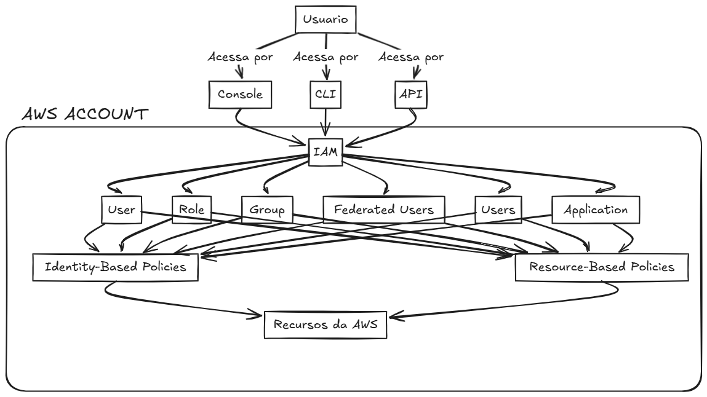
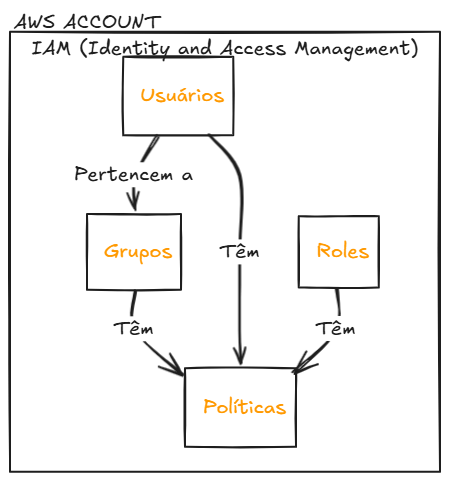
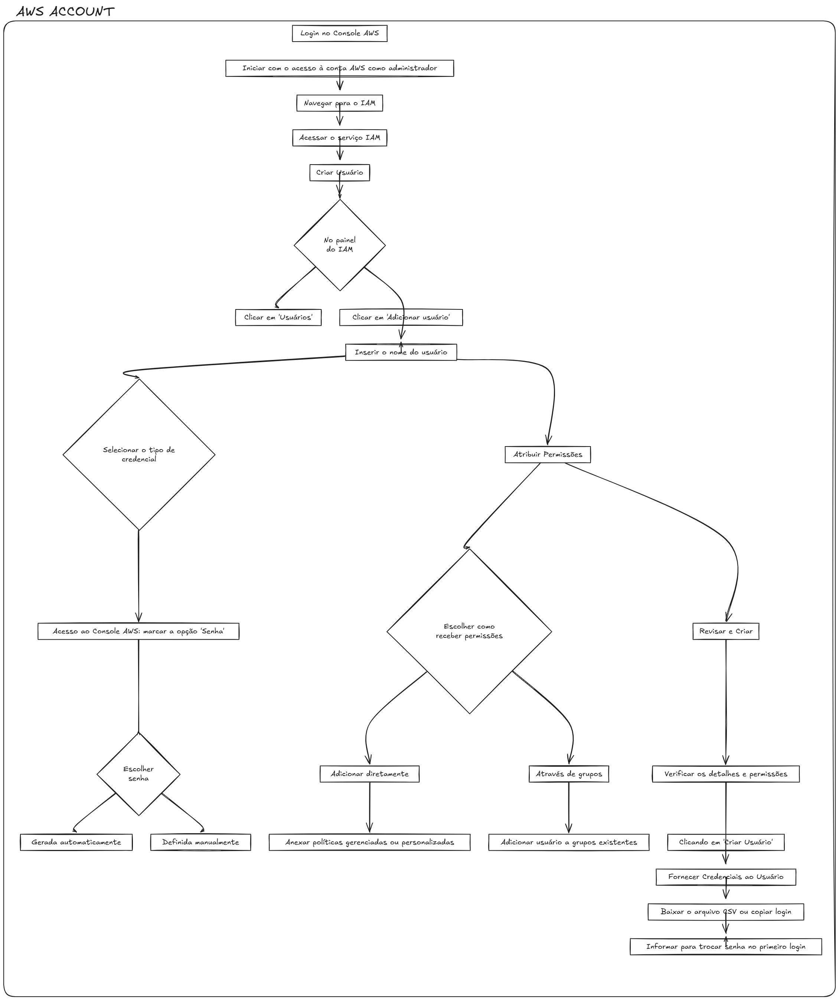

## IAM

Identity Access Management é aquele recurso dentro da AWS, que é server less, que garante que você tem privilégio ou não para iniciar executar qualquer ação dentro da WS.
É nesse ponto que você cria os seus usuários, seus grupos, suas regras e assim por diante.

IBP = Identity Beast Policy -> Utilizado para bloquear uma identidade. 
RBP = Resource Based Policy -> Utilizado para bloquear recurso.

Toda vez que crio algum recurso dentro da AWS, é uma API que verifica meu IAM para validar se eu tenho a permissão e ai sim cria o recurso que eu estou solicitando.

Quando é criado um usuário ele tem acesso ao:
- Console;
- CLI;
- API;
Mas não tem nenhum privilegio deve ser criado.

``Grupos`` são feitos para agrupar usuários, por exemplo você pode agrupar todos os usuários que são data science pois eles vão utilizar os mesmo recursos da AWS.

``Roles`` são feitas para permitir um serviço acessar o outro por exemplo:
- Eu posso subir uma instancia EC2 e dar a permissão para ele acessar um s3 espeficico.

``Policy`` são regras onde pode se permitir ou bloquear acesso dos grupos ou usuários, por exemplo:
- Posse criar uma policy que permite somente fazer upload ao s3 e direcionar essa policy para algum grupo ou usuário.

``!NUNCA`` devemos fazer nada na conta **ROOT** o ideal é criarmos uma outra conta com acessos especificos.

Fluxo para cadastro de novo usuário a partir da sua conta root.

Se o usuário for selecionar os recursos via conselo é interessante orientalo a habilitar o MFA para aumentar ainda mais a segurança.
Agora se o usuário for acessar via ``CLI``, ``API`` o root deve criar uma access key id e uma secret access key para poder manipular os recursos AWS.